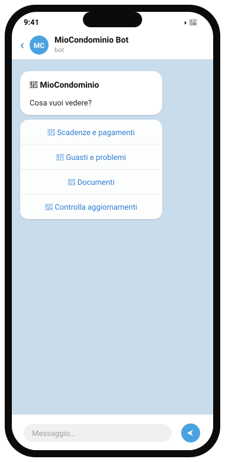
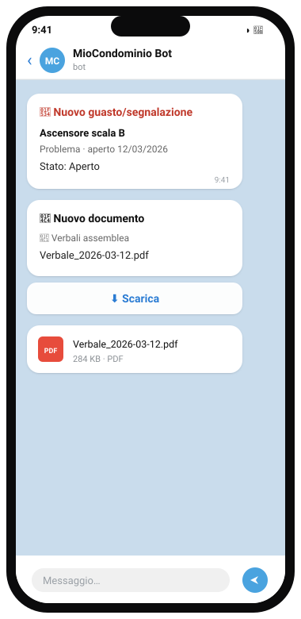
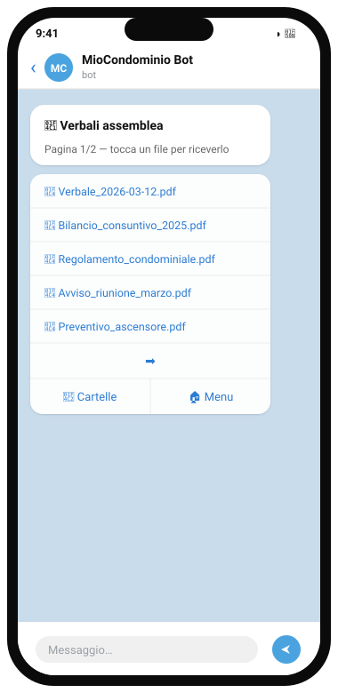
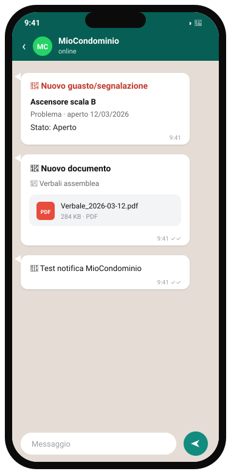

# MioCondominioBot

Bot Telegram che monitora il portale [miocondominio.eu](https://www.miocondominio.eu) e:

- 📋 permette di **consultare** scadenze, guasti e documenti tramite un **menu a bottoni** (navigazione avanti/indietro senza rifare `/start`);
- 🔔 **notifica** in automatico nuovi guasti, cambi di stato, nuovi documenti e nuove scadenze;
- 📄 su richiesta o dalla notifica **scarica il PDF, lo invia in chat e lo elimina** subito dalla macchina;
- 🟢 (opzionale) invia le notifiche di **nuovi documenti** e **guasti** anche su **WhatsApp** tramite [OpenWA](https://github.com/rmyndharis/OpenWA).

Funziona con **sole richieste HTTP** (nessun browser): login con cookie di sessione + scraping delle pagine ASP.

## Anteprima

<p align="center">
  
  &nbsp;&nbsp;&nbsp;
  
</p>

<p align="center"><em>A sinistra il menu (<code>/start</code>); a destra le notifiche con il pulsante «Scarica». Dati di esempio.</em></p>

<p align="center">
  
</p>

<p align="center"><em>Vista Documenti: cartella aperta con l'elenco dei file, paginazione e i pulsanti «Cartelle» / «Menu». Dati di esempio.</em></p>

## Prerequisiti Telegram

### 1) Creare il bot con BotFather

1. In Telegram apri la chat con **[@BotFather](https://t.me/BotFather)** (spunta blu) e premi **Avvia**.
2. Invia il comando **`/newbot`**.
3. Scegli un **nome** visibile (es. `MioCondominio`).
4. Scegli uno **username** che deve finire per `bot` (es. `MioCondominio_Buragobot`); dev'essere univoco.
5. BotFather risponde con il **token**, nel formato `123456789:AA...`. Copialo in `TELEGRAM_TOKEN_BOT` dentro il `.env`.

> ⚠️ Il token è come una password: non condividerlo e non metterlo su GitHub (il `.env` è già escluso).
> Se lo esponi per errore, usa `/revoke` su BotFather per generarne uno nuovo.

Comandi utili di BotFather (facoltativi): `/setdescription`, `/setuserpic`, `/mybots`.

### 2) Trovare il proprio Telegram ID

Serve il tuo **id numerico** (non lo username) da mettere in `TELEGRAM_ID_OWNER`.

1. In Telegram apri la chat con **[@userinfobot](https://t.me/userinfobot)** e premi **Avvia**.
2. Ti risponde subito con il tuo **Id** (es. `574520558`).
3. Incollalo in `TELEGRAM_ID_OWNER`.

Per abilitare **più persone**, chiedi a ciascuna il proprio id e mettili separati da virgola:

```
TELEGRAM_ID_OWNER='574520558,123456789,987654321'
```

Tutti gli id elencati potranno usare il menu **e** riceveranno le notifiche. Chiunque altro riceve «Non autorizzato».

> Suggerimento: dopo aver avviato il bot, ogni persona abilitata deve premere **Avvia**/`/start`
> nella chat del bot almeno una volta, altrimenti Telegram non gli recapita i messaggi.

## Configurazione

Tutto sta nel file `.env` (già presente, **non** versionato):

```
URL='https://www.miocondominio.eu/'
PORTAL_PID='...'            # codice condominio (pid)
PORTAL_USER='...'           # codice utente (login)
PORTAL_PASSWORD='...'       # password (case-sensitive)
TELEGRAM_TOKEN_BOT='...'    # token da @BotFather
TELEGRAM_ID_OWNER='...'     # uno o più id abilitati, separati da virgola: 111,222,333
POLL_MINUTES='15'           # opzionale: ogni quanti minuti controllare (default 15)
```

Trovi un modello pronto in [`.env.example`](.env.example). In `TELEGRAM_ID_OWNER` puoi
mettere **più id separati da virgola**: tutti potranno usare il bot e riceveranno le notifiche.

### Notifiche WhatsApp (opzionale, via OpenWA)

Oltre a Telegram, il bot può inviare le notifiche di **nuovi documenti** e **guasti/segnalazioni**
(nuovi e cambi di stato) anche su **WhatsApp**, usando un'istanza di
[OpenWA](https://github.com/rmyndharis/OpenWA) già installata e collegata (es. su un host della tua rete).

<p align="center">
  
</p>

<p align="center"><em>Le stesse notifiche su WhatsApp: guasto, nuovo documento con PDF allegato e il messaggio di <code>/testwa</code>. Dati di esempio.</em></p>

Aggiungi nel `.env`:

```
OPENWA_URL='http://HOST_OPENWA:2785'     # indirizzo dell'istanza OpenWA (porta default 2785)
OPENWA_API_KEY='...'                     # API key dalla dashboard OpenWA (header X-API-Key)
OPENWA_SESSION='default'                 # nome della sessione OpenWA, già creata e avviata
OPENWA_RECIPIENTS='393331234567'         # destinatari, separati da virgola
OPENWA_MAX_MB='64'                       # opzionale: dimensione max allegato su WhatsApp (default 64)
```

- I destinatari possono essere **numeri** con prefisso internazionale senza `+`
  (es. `393331234567`) oppure `chatId` completi (`393331234567@c.us`, o un gruppo `<id>@g.us`).
- Se **anche uno solo** di questi valori è vuoto, le notifiche WhatsApp restano **disattivate**
  e Telegram continua a funzionare normalmente. All'avvio il bot stampa lo stato (attive/disattivate).
- Per i **nuovi documenti** il bot allega direttamente il file su WhatsApp se rientra nel limite
  di `OPENWA_MAX_MB` (default 64 MB, WhatsApp arriva a ~100 MB); oltre quella soglia — o se il
  download fallisce — invia solo la notifica testuale rimandando al bot Telegram per scaricarlo.
- Per i **guasti** i messaggi sono di solo testo (niente bottoni).
- La sessione OpenWA (`OPENWA_SESSION`) va creata e avviata dalla dashboard di OpenWA scansionando
  il QR con il telefono, **prima** di avviare il bot.
- Per **verificare la configurazione** invia il comando `/testwa` al bot Telegram: manda
  «🔔 Test notifica MioCondominio» ai destinatari WhatsApp e riporta in chat esito ed eventuali errori.

## Avvio

```bash
npm install
npm start
```

- Al **primo avvio** il bot salva una *baseline* (`state.json`) senza inviare notifiche, così non ricevi tutto lo storico in una volta. Dai controlli successivi notifica solo le novità.
- In Telegram usa `/start` per aprire il menu. I bottoni navigano modificando lo stesso messaggio; **⬅️** torna indietro.
- `🔄 Controlla aggiornamenti` forza subito un controllo.

## Come funziona (in breve)

| File | Ruolo |
|------|-------|
| `src/portal.js` | login, sessione, parsing pagine, download documenti |
| `src/state.js`  | snapshot + persistenza per il confronto (diff) |
| `src/bot.js`    | menu a bottoni, notifiche, scheduler |
| `src/whatsapp.js` | invio notifiche WhatsApp via OpenWA (opzionale) |
| `index.js`      | avvio |

Pagine monitorate: `rate.asp` (scadenze), `segnalazioni.asp` (guasti), `documenti.asp` (documenti).

> Nota: le tabelle delle **scadenze** sono attualmente vuote sul portale; il diff sulle rate
> è generico e potrà essere affinato quando compariranno rate reali.
